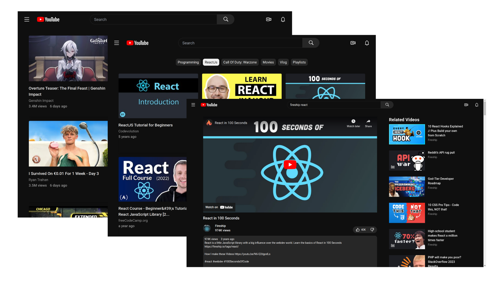

<div align="center">
  
</div>
<h1 align="center">
   YouTube Clone 
</h1>
<p align="center">
  <a href="https://youtube-by-yelinko.netlify.app/" target="_blank">  YouTube Clone </a> built with <a href="https://reactjs.org/" target="_blank"> React </a> and <a href="https://youtube-by-yelinko.netlify.app/" target="_blank"> Typescript </a> 
</p>
<br />

<a href="https://youtube-by-yelinko.netlify.app/" target="_blank"> Live Preview </a>

<br />
<br />
 <a href="https://ytbe.netlify.app/" target="_blank">
    
  </a>
  
  <br />
<br />
  <br />
<br />

> The app is built by cloning youtube as exactly as possible with all the features & design mocks up.

 <br />
<br />

## Built with

```bash

 React Typescript

 Redux-toolkit

 TailwindCSS React-Query

```

  <br />

## Used

```bash
 Vite(Typescript)       React-Router-Dom     Rapid API
```

  <br />

### Colors

| Color   | Hex                     |
| ------- | ----------------------- |
| Black   | `#0f0f0f`               |
| White   | `#f1f1f1`               |
| Glass1  | `rgba(255,255,255,0.1)` |
| SkyBlue | `#1c62b9`               |

<br />

### Fonts

```bash
Roboto
```

 <div align="center">
  
  <h6> Built By <a href="https://github.com/yelinko20">Ye Lin Ko</a></h1>
</div>
